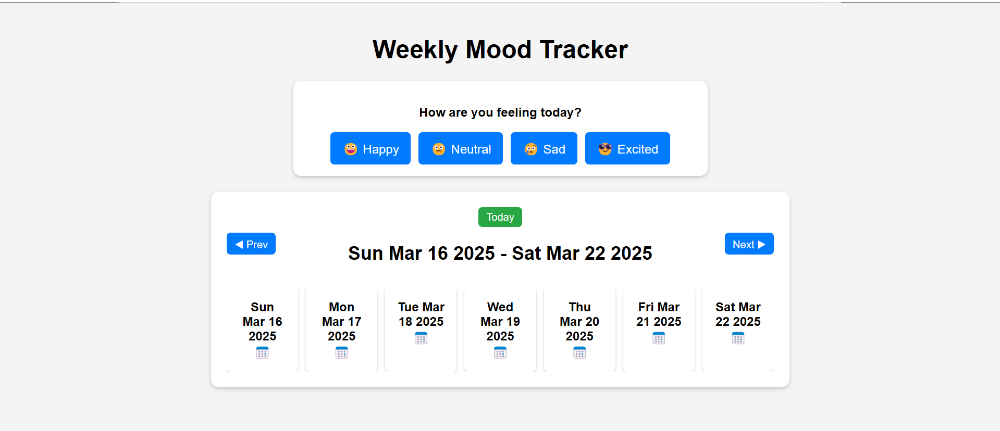
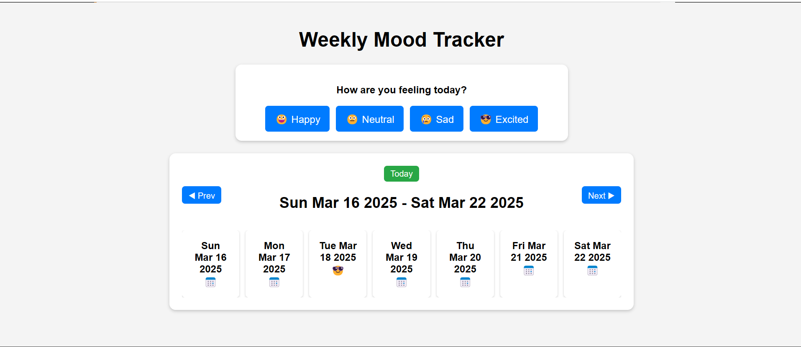
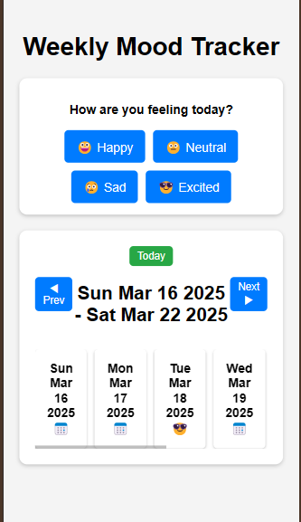

# Mood Tracker

## Overview
The Mood Tracker is a simple web application that allows users to log their daily mood and view past moods in a weekly calendar format. The app stores moods locally in the browser and provides a clean UI for tracking emotional trends.

## Features
- Select a mood for the day from predefined options (Happy, Neutral, Sad, Excited).
- Stores mood history in LocalStorage.
- Displays a weekly calendar view of moods.
- Navigate between weeks using "Next" and "Prev" buttons.
- "Today" button to jump back to the current week.
- Responsive design for mobile and desktop users.

## Technologies Used
- HTML
- CSS
- JavaScript (Vanilla JS)
- LocalStorage for storing mood data

## Installation & Usage
1. Clone the repository:
   ```sh
   git clone https://github.com/dhimannikhil300/MoodTrackerApp.git
   ```
2. Open `index.html` in your browser.
3. Select a mood to save it for the day.
4. Use the weekly calendar to view past moods.

## Deployment
The application is hosted on **[Live Demo Link](https://sage-entremet-eb40c7.netlify.app/)**.

## Screenshots
  
  
 


## Submission
- GitHub Repository: [Repository Link](https://github.com/dhimannikhil300/MoodTrackerApp.git)
- Live Demo: [Deployment Link](https://sage-entremet-eb40c7.netlify.app/)

